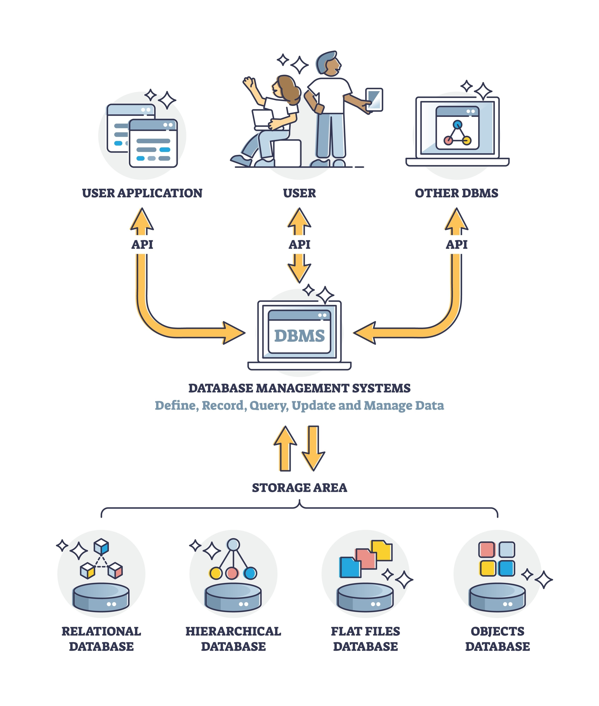

# DBChaos: 基于数据库内核原语构造的不利注入工具



## 1. 项目定位

**DBChaos** 是一款面向数据库系统的**不利注入工具**。  
它不是单纯从业务侧叠加压力，而是从数据库**内核子系统**出发，主动构造连接、优化、执行、事务、存储、日志等路径上的不利条件，用来探测数据库系统的**韧性边界**与**韧性能力**。

换句话说，DBChaos 关注的问题是：

- 数据库在异常压力或机制扰动下会在哪里失稳
- 数据库是否还能维持服务、退化运行或自动恢复
- 数据库不同内核子系统之间的隔离性、恢复性和抗压能力如何

---

## 2. 工具特点

- **内核子系统视角**：不利点围绕数据库连接、SQL 编译、执行、事务、存储、日志等核心路径组织。
- **机制级注入**：通过 SQL、事务、连接和资源占用等方式诱发数据库内部机制变化，而不是只从外部施压。
- **多语系适配**：当前实现面向 openGauss、PostgreSQL 及 MySQL 兼容语系。
- **适合压测联动**：可与 TPC-C 等基准测试联动，在业务负载运行期间注入不利并观察系统行为变化。

---

## 3. 当前已覆盖的内核子系统

DBChaos 当前按如下数据库内核子系统组织不利能力：

- 连接与会话管理
- SQL 编译与优化
- 执行引擎与运行时
- 事务与并发控制
- 存储引擎与缓冲管理
- 日志、检查点与崩溃恢复
- 后台维护与系统任务
- 资源治理与系统配额

其中，当前已经有落地不利 Case 的主要是前六类。

---

## 4. 当前已实现的不利 Case

### 连接与会话管理

- **连接风暴**：`max_connection / conn_storm`
- **连接耗尽**：`max_connection / conn_exhaustion`
- **会话执行线程池饱和**：`max_connection / thread_saturation`

### SQL 编译与优化

- **执行计划翻转**：`plan_flip`
- **深层表达式解析膨胀**：`stack_overflow / sql_depth`
- **视图展开深度膨胀**：`stack_overflow / view_nest`
- **Join 搜索空间爆炸**：`stack_overflow / join_bomb`

### 执行引擎与运行时

- **函数递归执行栈溢出**：`stack_overflow / func_recurse`
- **存储过程递归执行栈溢出**：`stack_overflow / proc_recurse`
- **事务路径递归执行栈溢出**：`stack_overflow / trans_recurse`

### 事务与并发控制

- **长事务持锁**：`uncommitted_txn`
- **热点更新冲突**：`duplicate_txn / UPDATE`
- **重复插入唯一性冲突**：`duplicate_txn / INSERT`
- **Prepared/XA 事务积压**：`max_prepared`

### 存储引擎与缓冲管理

- **大对象写入缓冲挤压**：`memory_pressure`

### 日志、检查点与崩溃恢复

- **高频事务回滚风暴**：`massive_rollback`

---

## 5. 系统结构

项目当前由三部分组成：

- **Core 层**：负责配置加载、数据库类型适配与 JDBC 连接基础能力
- **Inject 层**：每个不利 Case 对应一个具体注入实现
- **CLI / Script 层**：负责命令行入口、帮助信息以及与外部压测/配置脚本的联动

---

## 6. 快速开始

### 环境依赖

- JDK 1.8+
- Maven 3.6+
- 目标数据库：openGauss、PostgreSQL 或 MySQL 兼容引擎

### 构建项目

```bash
chmod +x build.sh
./build.sh DBChaos
```

### 查看当前支持的不利入口

```bash
java -jar DBChaos-0.0.1.jar --help
```

### 执行一个不利注入

以 openGauss 上的执行计划翻转为例：

```bash
java -jar DBChaos-0.0.1.jar opengauss plan_flip -threads 16 -duration 300000 -interval 60000
```

---

## 7. 与压测联动

如果需要在 TPC-C 或其他基准测试运行期间注入不利，可以结合 `scripts/` 下的配置生成脚本使用。  
相关说明见：

- [scripts/README.md](./scripts/README.md)

---

## 8. 开发者

- **Author**: 西北工业大学
- **Project**: DBChaos
