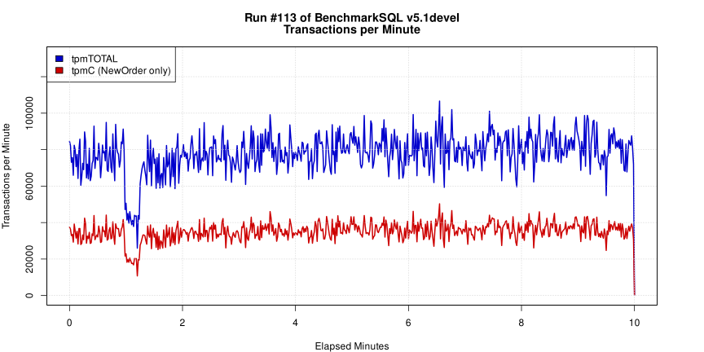
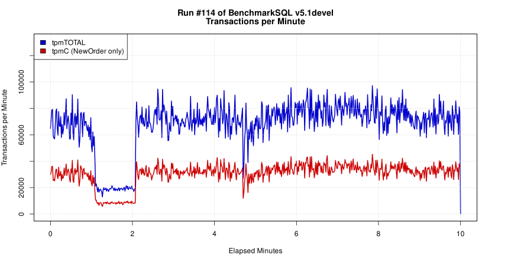
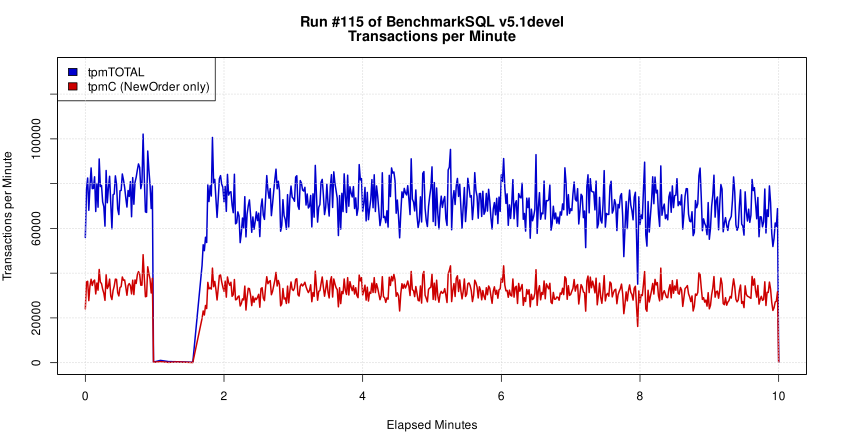

# DBChaos Demo: 数据库韧性故障画像自动化验证

本目录提供了一套 **“一键式”** 韧性验证方案。通过 `demo.sh` 脚本，您可以自动化地联动基准测试工具（BenchmarkSQL）与故障注入工具（DBChaos），观察数据库在极端故障压力下的性能表现及恢复能力。


## 1. 环境准备

在运行 Demo 之前，请确保以下环境已配置完毕：

1. **JDK 1.8+**: 确保 `java` 命令可用。
2. **BenchmarkSQL 5.0+**: 已安装并完成数据装载（Data Build）。
3. **DBChaos JAR**: 已在项目根目录执行 `./build.sh` 生成最新的 `DBChaos-0.0.1.jar`。
4. **数据库连接**: 确保 `../resources/db.properties` 中的连接信息正确，且数据库处于运行状态。


## 2. 配置说明

编辑 `demo.sh` 脚本顶部的 **配置区**：

```bash
# BenchmarkSQL 的 run 目录绝对路径 (必须包含 runBenchmark.sh)
BENCHMARK_RUN_PATH="/your/path/to/benchmarksql-5.0/run"

# 默认故障时序逻辑 (脚本内固定)
INJECT_DELAY=3     # 压测启动 3 分钟后注入故障
FAULT_DURATION=1   # 故障持续时间 1 分钟
```


## 3. 使用方式

在 `demo/` 目录下执行脚本，直接传入故障参数即可。脚本会自动识别全局配置中的数据库类型。

### 常用验证指令：

#### A. 连接风暴 (Connection Storm)

模拟瞬间爆发的大量短连接冲击，测试监听队列和认证性能。

```bash
./demo.sh max_connection -mode conn_storm -count 200
```



#### B. 连接耗尽 (Connection Exhaustion)

模拟大量连接被持续占用不释放，直到挤兑完 `max_connections` 上限。

```bash
./demo.sh max_connection -mode conn_exhaustion
```



#### C. 线程池饱和 (Thread Saturation)

模拟数据库内核工作线程被长耗时请求占满，导致业务 SQL 排队。

```bash
./demo.sh max_connection -mode thread_saturation -count 32
```



## 4. 运行流程与预期结果

### 运行逻辑：

1. **启动压测**: 脚本拉起 BenchmarkSQL，默认运行 10 分钟。
2. **平稳期 (0-3min)**: 数据库处于正常负载，TPS 曲线平稳。
3. **注入期 (3-4min)**: DBChaos 介入，执行指定的故障画像。此时您会观察到 TPS 出现明显下跌或剧烈抖动。
4. **恢复期 (4-10min)**: 故障任务结束，观察数据库是否能自动回升至初始性能水平。
5. **生成报告**: 压测结束后，自动调用 R 语言引擎在 `results/` 目录下生成可视化 HTML 报告。

### 结果查看：

结果存储在 `demo/results/<db_type>/<timestamp>/`。

- `report.html`: 包含 tpmC 曲线、延迟分布、系统资源画像。


## ⚠️ 注意事项

- **清理**: 脚本会自动清理 `temp_run.properties` 临时文件。
- **权限**: 如果提示权限不足，请执行 `chmod +x demo.sh`。
- **日志**: 驱动冗余日志已在 `Main.java` 中被压制，控制台将仅保留核心状态信息。